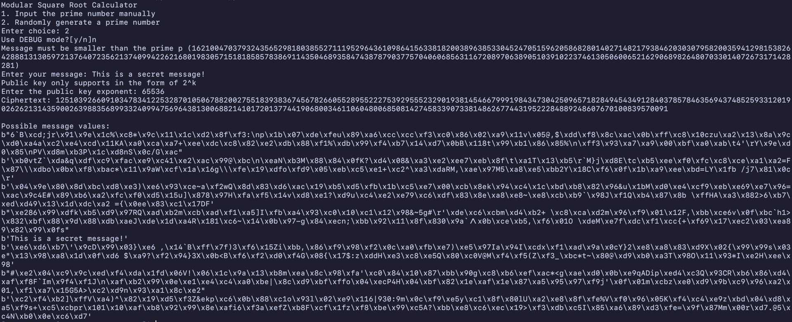

# Prime Modulo RSA Cracker Tool

A Simple prime modulo RSA cracker tool.

I made this to show that a prime modulo in RSA
is easily crackable with simple algorithms.

## Table of Contents
* [General Info](#general-information)
* [Technologies Used](#technologies-used)
* [Features](#features)
* [Screenshots](#screenshots)
* [Setup](#setup)
* [Usage](#usage)
* [Project Status](#project-status)
* [Room for Improvement](#room-for-improvement)
* [Acknowledgements](#acknowledgements)
* [Contact](#contact)


## General Information
- A TUI based RSA cracker tool
- Made to show how bad it is to have a prime modulo in an RSA cryptosystem


## Technologies Used
- Python - version 3.11.3
- cryptography - version 40.0.2


## Features
- Tonelli-Shanks algorithm implemented (Special thanks to [ZeroBone](https://zerobone.net/blog/math/tonelli-shanks/))
- Quadratic-Residue algorithm implemented


## Screenshots



## Setup
Make sure all requirements are installed in your local machine beforehand.

```bash
pip install cryptography
```

Then, clone this repository.

```bash
git clone git@github.com:sozyGithub/Tubes2_bebas.git
```

Change to the repository directory, then run the `main.py` file.

```bash
python src/main.py
```


## Usage
How does one go about using it?
Provide various use cases and code examples here.

`write-your-code-here`


## Project Status
Project is: in progress


## Room for Improvement
Include areas you believe need improvement / could be improved. Also add TODOs for future development.

Room for improvement:
- Timer

To do:
- Add a GUI visualizer


## Acknowledgements
Give credit here.
- This project was inspired by one of the problems from [CryptoHack](https://cryptohack.org/)
- Many thanks to ZeroBone for explaining Tonelli-Shanks algorithm wonderfully


## Contact
You can ask me additional questions through my email frankiehuang@proton.me

README template created by [@flynerdpl](https://www.flynerd.pl/)
